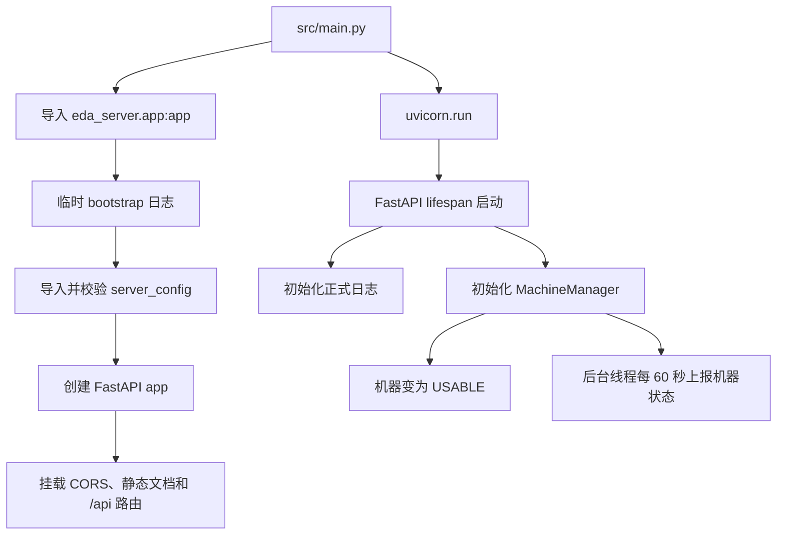
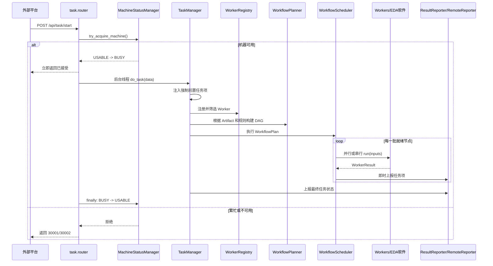
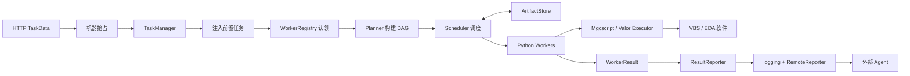

# SV-EDAServer-Platform 项目快速上手指南（Python 初学者版）

> 分析范围：`src/`，并结合 `config/`、`tests/`、`pyproject.toml` 理解运行方式。  
> 分析日期：2026-08-19。本文是静态代码导读；真正执行 EDA 检查需要 Windows、对应 EDA 软件和正确配置。

## 1. 先用一句话理解项目

这是一个运行在 **Windows EDA 工作站**上的 FastAPI 服务：外部平台通过 HTTP 下发 PCB 检查任务，服务把任务拆成有依赖关系的工作节点，调用 Xpedition/Expedition、Valor 和 VBScript 完成检查，最后把进度、结果和机器状态上报给外部 Agent。

它不是普通的增删改查 Web 项目。Web API 只是“接单窗口”，真正核心是：

1. 配置与请求数据校验；
2. 机器占用状态管理；
3. Worker 注册与任务认领；
4. DAG（有向无环图）规划和调度；
5. 外部 EDA 软件自动化；
6. 日志和结果上报。

## 2. 先认识 EDA 业务名词

| 名词 | 初学者理解 |
|---|---|
| PCB | 印制电路板；这里主要处理 PCB 设计工程文件 |
| `.prj` / `.pcb` | 项目文件与 PCB 设计文件 |
| DRC | Design Rule Check，设计规则检查 |
| Gerber | PCB 制造常用的图形输出文件 |
| IPC Netlist | 用于描述电气连接关系的网表文件 |
| Xpedition / Expedition | Siemens/Mentor 的 PCB 设计软件；代码通过 `mgcscript.exe` 和 VBS 驱动它 |
| Valor | 制造性分析/检查工具；代码通过 `get.exe`、`gnd.exe`、`rcom.exe` 驱动它 |
| Agent | 位于 EDA Server 外部的上游服务，负责下发任务和接收状态/日志 |
| Worker | 完成一个明确步骤的 Python 类，例如解压项目、启动 PCB、提取参数或执行 DRC |
| Artifact | Worker 之间传递的中间产物，例如 PCB 文件路径、PCB 程序已启动标记、提取出的参数 |
| DAG | 节点之间只有单向依赖且无环的执行图；保证“先准备文件，再启动软件，最后检查” |

## 3. 技术栈与运行限制

项目在 `pyproject.toml` 中固定使用 Python **3.11.9**，主要依赖如下：

| 技术 | 用途 |
|---|---|
| FastAPI + Uvicorn | HTTP 服务和运行服务器 |
| Pydantic 2 | 请求体、配置文件的数据建模和校验 |
| httpx / requests | 向 Agent 上报；测试脚本发送请求 |
| pandas / openpyxl | 表格数据处理（部分检查结果场景） |
| py7zr / rarfile | 解压 7z、rar 等项目压缩包 |
| pywinauto / PyQt5 / pyjab | Windows GUI、对话框和 Java Access Bridge 自动化 |
| Poetry | 依赖与虚拟环境管理 |
| PyInstaller（从 `.spec` 推断） | 打包 Windows 可执行程序 |

重要限制：

- 项目明显依赖 Windows 注册表、Windows 进程、GUI 和本机 EDA 软件，不能期望在普通 Linux 或未安装 EDA 软件的电脑上跑通完整业务。
- 配置加载时就可能查注册表定位 `mgcscript.exe`，也可能读取 `VALOR_ENV_FILE`；环境不完整时，甚至导入应用阶段就会失败。
- 仓库强调 UTF-8。VBS、中文路径和 Windows ANSI 设置混用时容易乱码。
- 服务只有一台逻辑“机器资源”，HTTP 层通过状态锁限制同一时刻只接一个大任务；一个任务内部的 DAG 节点仍可并行。

## 4. 目录地图

```text
src/
├─ main.py                         # Uvicorn 进程入口
├─ eda_server/
│  ├─ app.py                       # FastAPI 应用、生命周期、中间件
│  ├─ app_bootstrap.py             # 正式日志初始化前的临时日志
│  ├─ config/
│  │  ├─ manager.py                # 多层 JSON 配置加载入口
│  │  ├─ model/                    # 配置的 Pydantic 模型
│  │  ├─ contract/                 # HTTP 任务数据模型
│  │  └─ my_enum/                  # 任务、状态、资源等枚举
│  ├─ route/                       # `/api` HTTP 路由
│  ├─ core/
│  │  ├─ machine/                  # USABLE/BUSY/UNUSABLE 状态机
│  │  ├─ task/                     # TaskManager 与工作流引擎
│  │  │  └─ workflow/              # 注册、规划、调度、产物、上报
│  │  └─ worker/                   # 各类 EDA 业务 Worker
│  ├─ libs/
│  │  ├─ eda_executor/             # mgcscript、Valor 的执行适配器
│  │  ├─ logger/                   # 控制台/文件/远程日志
│  │  └─ system/                   # 文件、进程、服务、注册表工具
│  └─ static/                      # 离线 Swagger/ReDoc 资源
└─ eda_vbscripts/                  # 真正操作 PCB 软件的 VBS 脚本
```

`src` 当前约有 123 个 Python 文件、7,700 多行 Python，以及 20 个 VBS 文件、3,800 多行 VBS。不要从第一个文件开始逐行硬啃，应该沿主调用链阅读。

## 5. 服务启动调用链



### 5.1 `src/main.py`

`run_server()` 判断 `sys.frozen`：

- 被 PyInstaller 打包时，直接把 `app` 对象交给 Uvicorn；
- 开发环境时，传入字符串 `"main:app"`，便于 Uvicorn 重载模块。

`if __name__ == "__main__":` 表示仅当该文件被直接运行时启动服务；被别的模块导入时不自动启动。

### 5.2 `eda_server/app.py`

这里完成四件事：

1. 用 `FastAPI(...)` 创建应用；
2. 添加允许跨域的 `CORSMiddleware`；
3. 挂载离线 Swagger/ReDoc 和业务路由；
4. 用 `lifespan` 管理启动与关闭资源。

`@asynccontextmanager` 修饰的 `lifespan()` 在 `yield` 前执行启动逻辑，在 `yield` 后执行关闭逻辑。这与普通 `with` 上下文管理器的思路相同，只是它用于异步应用生命周期。

### 5.3 配置为什么在启动早期就生效

`config/manager.py` 文件末尾直接创建：

```python
server_config = ConfigManager()
```

Python 第一次导入这个模块时就会执行该语句。因此配置文件缺失、JSON 错误、注册表或 EDA 环境缺失，都可能在 Web 服务真正启动前暴露。这叫“模块级单例”，使用方便，但也让导入带有较强副作用。

## 6. HTTP API 与一次完整任务

### 6.1 路由表

| 方法与路径 | 作用 |
|---|---|
| `GET /` | 健康检查，返回服务正在运行 |
| `GET /api/machine/status` | 查询机器状态 |
| `POST /api/task/start` | 下发任务 |
| `GET /docs` | 使用仓库内静态资源的 Swagger UI |
| `GET /openapi.json` | FastAPI 自动生成的 OpenAPI 描述 |

注意：`static/static.py` 中 ReDoc 装饰器写的是 `@app.get("redoc")`，没有前导 `/`，这很可能导致预期的 `/redoc` 不可用。

### 6.2 为什么 API 是 `async`，业务却进入线程池

`start_task()` 是 `async def`，因为它处于 FastAPI 异步 Web 层。但 EDA 自动化、文件操作和外部进程调用是阻塞式工作。如果直接放在事件循环中，会卡住其他 HTTP 请求。

所以代码先用 `BackgroundTasks` 延后执行，再在 `machine_status_wrapper()` 中调用：

```python
await run_in_threadpool(do_task, data)
```

可以把它理解为：Web 接口尽快回复“已接单”，耗时工作交给普通线程。

### 6.3 完整调用链



## 7. 请求数据模型与状态

`TaskData` 是整张任务单，`TaskItemData` 是其中一个检查项。它们继承 Pydantic 的 `BaseModel`。

一个精简请求示例：

```json
{
  "platform": "PCB",
  "taskNo": "PCB-DEMO-001",
  "taskType": "DESIGN_CHECK",
  "businessCode": "DEMO",
  "pcbId": "PCB-9999",
  "pcbNumber": "57300009999",
  "pcbVersion": "AB",
  "projectFilePath": "D:\\projects\\demo.zip",
  "taskItem": [
    {"itemCode": "EXTRACT_PCB_DATA"},
    {"itemCode": "DRC_BROKEN_CHECK"}
  ]
}
```

Pydantic 会把 JSON 字符串自动转换成 `TaskType` 等枚举，并补上默认状态。`extra="allow"` 表示上游多传字段时不会被拒绝。`validate_assignment=True` 表示对象创建后重新给字段赋值也会校验。

### 7.1 三组状态不要混淆

- `MachineStatus`：整台机器是否可接任务，`UNUSABLE(0)`、`BUSY(1)`、`USABLE(2)`。
- `TaskStatus`：整张任务单，`RUNNING(1)`、`FINISH(4)`、`FAIL(9)`。
- `ItemStatus`：单个检查项，从 `PENDING`、`PROCESSING` 到最终通过/失败。

上报 Agent 时，内部数字型 `ItemStatus` 会转成 Agent 约定的字符串 `RUNNING`、`PASS` 或 `NO_PASS`。

## 8. 配置系统：最值得学习的 Pydantic 用法

配置入口是 `ConfigManager`：

```text
root_config_dev.json
├─ env/env_config.json
├─ server/server_config_dev.json
├─ agent/agent_config_dev.json
└─ eda/eda_config.json
   ├─ batch_drc/...
   ├─ sv_drc/...
   ├─ hyperlynx_drc/...
   ├─ valor_npi/...
   └─ pcb_script/...
```

开发环境选 `root_config_dev.json`，打包环境选 `root_config.json`。`RootConfig.model_validate(data, context=...)` 校验根配置，并通过 Pydantic 的 validation context 把程序根目录传给子验证器。

### 8.1 `Annotated` 自定义字段处理链

`annotation.py` 定义了类似：

```python
ResolvedPath = Annotated[
    Path,
    AfterValidator(resolve_relative_path),
    AfterValidator(existence_check),
]
```

含义是：这个字段最终是 `Path`，解析后依次执行“转绝对路径”和“检查是否存在”。`ConfigModel` 则在校验前把一个 JSON 文件路径变成相应的 Pydantic 子模型。这样模型声明保持简洁，加载逻辑集中复用。

### 8.2 注册表模式

`MODEL_REGISTRY` 把配置字段名映射到模型类：

```python
"server" -> ServerConfig
"eda" -> EdaConfig
"batch_drc" -> BatchDRCConfig
```

验证器通过 `info.field_name` 查出应该实例化哪个类。以后新增配置类型时，不仅要写模型和 JSON，还要记得在注册表登记。

## 9. 工作流引擎：项目核心

### 9.1 `TaskContext`：一次任务共享的背包

它保存：

- `data`：任务请求；
- `cfg`：全局配置；
- `wdir`：任务工作目录；
- `project`：`.prj`、`.pcb` 和 PCB 参数；
- `resource`：软件是否启动、是否需要保持打开等运行标志。

它使用 `@dataclass(kw_only=True)`，所以构造时必须写参数名，更不容易把多个同类型参数传反。`field(default_factory=...)` 为每个实例创建独立的可变对象，避免多个任务错误共享同一个默认对象。

### 9.2 Worker 如何认领任务

每个 Worker 继承 `BasicNodeWorker`，通过类属性声明能力：

```python
target_items = {TaskType.EXTRACT_PCB_DATA}
input_artifacts = {ArtifactKey.PCB_PROGRAM}
output_artifacts = {ArtifactKey.PCB_PARAMETER}
exclusive_resources = {TaskResourceType.PCB_PROGRAM}
```

`WorkerRegistry` 创建全部候选 Worker，然后调用 `retrieve_target_items()`。只有认领到请求中 `PENDING` 任务项的 Worker 才进入主计划。不受支持的任务项会被标记失败。

### 9.3 Planner 如何自动补齐节点

`WorkflowPlanner` 不要求调用方手写执行顺序，而是根据 Artifact 推导：

- 某节点需要 `PCB_FILE` → 自动补 `ProjectArchiveProcessor`；
- 需要 `PCB_PROGRAM` → 再自动补 `PCBProgramLauncher`；
- 需要 `PCB_PARAMETER` → 再自动补 `PCBParameterExtractor`；
- 所有流程最后补一个 `PCBProgramCloser` 清理节点。

然后建立“生产者 → 消费者”依赖，并检查：

- 一个 Artifact 不能有两个生产者；
- 每个输入 Artifact 必须有生产者；
- 节点依赖不能形成环。

### 9.4 强制业务前置规则

当任务包含 Valor、HLD 或 SVDRC 标准检查时，`flow_rules.py` 会自动注入：

- 项目同步检查；
- DRC 开路检查；
- DRC 未放置检查；
- PCB 设计数据提取。

Planner 还会添加显式依赖。这样即使上游漏传这些任务项，生产资料输出也不能绕过基础验证；如果前置节点失败，下游会被跳过。

### 9.5 Scheduler 如何执行

调度器反复做以下动作：

1. 找出所有依赖成功且输入 Artifact 已就绪的 `PENDING` 节点；
2. 没有独占资源的节点放入 `ThreadPoolExecutor` 并行执行；
3. 声明了独占资源的节点按顺序执行；
4. 保存 Worker 返回的新 Artifact；
5. 更新节点状态并即时上报任务项；
6. 失败节点的下游默认标为 `SKIPPED`；
7. 清理节点允许上游失败，仍会获得执行机会。

当前“独占资源”实现比较保守：只要节点声明任意独占资源，就进入串行列表；尚未做到不同资源之间分别加锁。

## 10. Worker 一览

| Worker | 认领的任务项 | 输入 → 输出 | 主要动作 |
|---|---|---|---|
| `ProjectArchiveProcessor` | 通常由 Planner 自动补 | 无 → 项目目录、PRJ、PCB | 解压压缩包，寻找最浅层 `.prj` 和 `.pcb` |
| `PCBProgramLauncher` | `LAUNCH_PCB_PROGRAM`，也可自动补 | PCB 文件 → PCB 程序 | 调用 VBS 启动 PCB 软件并处理弹窗 |
| `PCBParameterExtractor` | `EXTRACT_PCB_DATA` | PCB 程序 → PCB 参数 | 运行提取脚本并解析 JSON 报告 |
| `SvDrcChecker` | 当前代码实际认领 `PRJ_SYNC_CHECK` | PCB 程序 | 执行 SV DRC 类脚本并更新结果 |
| `BatchDRCChecker` | `DRC_BROKEN_CHECK`、`DRC_UNPLACED_CHECK` | PCB 文件、PCB 参数 → DRC 结果 | 执行 Batch DRC，解析树形结果并分别分析开路/未放置 |
| `GerberNetlistChecker` | `GERBER_NETLIST_CHECK` | 当前类未声明 Artifact 输入 | 驱动 Valor 导入 Gerber/网表、比较和后处理 |
| `PCBProgramCloser` | 清理节点，不认领用户任务 | PCB 文件 | 需要时关闭 PCB 软件 |

需要特别留意：`TaskType` 枚举声明的任务种类多于默认注册表真正支持的 Worker。看到枚举值不等于当前服务已经实现该功能；应以 `create_default_worker_registry()` 为准。

## 11. 外部 EDA 执行层

### 11.1 `MgcscriptExecutor`

这是 Python 与 Xpedition/Expedition VBS 之间的适配器。Worker 传入：

- `mgcscript.exe` 路径；
- VBS 文件；
- 工作目录和日志文件；
- 脚本参数；
- 超时时间。

执行器负责启动进程、监视日志结束标记、处理超时和脚本错误。VBS 才是在 EDA 软件对象模型里点击/读取/检查的真正执行者。

### 11.2 `ValorExecutor` 与命令系统

Valor 部分不是简单拼接一条命令，而是把命令建模为模板：

```text
JSON 模板
  -> template_loader
  -> CommandRegistry
  -> CommandRenderer
  -> CommandFlowBuilder
  -> ExecutableCommand
  -> ValorExecutor / rcom.exe
```

这种设计把“命令定义”“参数渲染”“执行顺序”和“进程执行”分开，方便复用和校验。Gerber 网表检查还包含输入报告解析、网表报告解析、主动短接网络管理以及按命令类型注册的后处理器。

## 12. 日志为什么还能承担上报功能

项目对 Python 标准库 `logging` 做了扩展。业务代码写日志时通过 `extra=LogTag(...)()` 附加：

- category：日志类别；
- task_id：任务号；
- report：是否远程上报；
- code/data：状态码或结构化任务数据。

`PlatformLoggerManager` 同时管理：

1. 控制台日志；
2. 按天轮转的系统日志；
3. 当前任务独立日志；
4. `RemoteReporter` 远程上报 Handler。

`RemoteReporter.emit()` 不直接发送网络请求，而是把数据放进 `queue.Queue`；后台守护线程使用 `httpx.post()` 发送，失败后指数退避重试。这样业务线程不必等待 Agent 网络响应。

这里体现了标准 logging 的扩展点：自定义 `Logger`、`Handler`、`Filter` 和 `Formatter`。

## 13. 项目中需要掌握的 Python 知识

### 13.1 模块、包和导入

含 `__init__.py` 的目录是传统 Python 包。大量 `from .xxx import *` 会把子模块公开名称集中导出，使调用方导入简短，但也会让名称来源不明显。阅读时善用 IDE 的“转到定义”，并查看模块的 `__all__`。

- `from .model import *`：相对导入，同一个包内寻找模块；
- `from eda_server.config import TaskData`：从顶层包绝对导入；
- 函数内部导入：常用于避免循环依赖，项目的配置模型注册处有这类做法。

### 13.2 类型注解

```python
Path | str | None
dict[ArtifactKey, Any]
list[type[BasicNodeWorker]]
```

- `A | B` 是联合类型；
- `None` 表示参数可为空；
- `list[T]`、`dict[K, V]` 是泛型容器；
- `type[X]` 表示“X 类本身”，不是 X 的实例；
- `Any` 表示暂不限制类型。

类型注解通常不会在运行时自动强制类型，但 IDE、类型检查器和 Pydantic 会使用它们。

### 13.3 类、继承和抽象基类

`BasicNodeWorker(ABC)` 是抽象基类，`@abstractmethod` 要求子类实现 `run()`。公共逻辑放在父类，如任务项认领和失败标记；不同 EDA 步骤在子类中实现。这是“模板方法/多态”的实际例子。

### 13.4 类属性与实例属性

`target_items`、`input_artifacts` 是类属性，描述一类 Worker 的固定能力；`work_items`、`task_context` 是实例属性，属于某一次任务中的具体 Worker。可变类属性要谨慎：如果代码修改它本身，所有实例都会受影响。本项目大多只读取这些集合。

### 13.5 `dataclass`

工作流的数据载体大量使用 `@dataclass`，它自动生成 `__init__`、`__repr__` 等样板代码。

- `frozen=True`：实例不可重新赋值，`NodeId` 因此适合作为稳定标识；
- `kw_only=True`：只能用关键字传参；
- `field(default_factory=list)`：为每个实例创建新列表；
- `__post_init__()`：自动初始化完成后的补充逻辑。

### 13.6 枚举与 `match/case`

`IntEnum` 同时像整数和枚举，适合协议状态码；`StrEnum` 同时像字符串和枚举，适合 JSON 中的任务类型。`match/case` 是 Python 3.10+ 的模式匹配，本项目用它按任务类型、日志类别选择处理分支。

### 13.7 属性 `@property`

`BasicNodeWorker.data`、`cfg`、`wdir` 把深层访问封装起来：调用方写 `self.data`，内部实际返回 `self.task_context.data`。外观像字段，背后是方法。

### 13.8 上下文管理器

```python
with TaskManager(task_data=data) as task_manager:
    task_manager.run()
```

进入 `with` 时调用 `__enter__()` 建立任务日志，退出时无论成功或异常都会调用 `__exit__()` 清理。这非常适合文件、锁、日志 Handler、外部资源等必须成对开启/关闭的对象。

### 13.9 异常与异常链

```python
raise TaskManagerError("初始化失败") from e
```

`from e` 保留底层异常作为原因，排错时能同时看到业务语义和原始堆栈。裸 `except:` 会捕获包括系统退出在内的所有异常，通常更推荐 `except Exception:`；项目中仍存在数处裸捕获，修改时应谨慎收窄。

### 13.10 并发：线程、线程池、锁和队列

- `Thread(..., daemon=True)`：后台守护线程，主进程退出时不阻止结束；
- `ThreadPoolExecutor`：并行执行当前已就绪的 Worker；
- `RLock`：保护机器状态读写，并允许同一线程重入；
- `Lock`：保护日志 Handler 切换；
- `queue.Queue`：在线程之间安全传递远程上报数据；
- `Future` 和 `as_completed()`：哪个并行任务先完成就先处理哪个。

线程适合这里的阻塞式外部进程、文件和网络 I/O。Python 线程不等于所有 CPU 计算都能线性加速。

### 13.11 推导式、集合运算和生成器思维

```python
failed_nodes = {node.id for node in plan.all_nodes() if node.status == NodeStatus.FAILED}
duplicated = supported & target_items
injected = prerequisites - existing
```

集合的交集 `&`、差集 `-` 很适合表达注册冲突和缺失前置项。列表/字典/集合推导式能简洁完成“遍历 + 筛选 + 转换”，但过度嵌套时应拆成普通循环。

### 13.12 `pathlib.Path`

项目优先用 `Path` 处理路径：

```python
log_file = work_dir / "logs" / "run.log"
path.resolve()
path.rglob("*")
path.suffix.lower()
```

这比手工拼接 `\\` 更安全、更可读。传给只接受字符串的第三方程序时再调用 `str(path)`。

### 13.13 装饰器

- `@router.post(...)`：把函数注册为路由；
- `@classmethod`：第一个参数是类 `cls`；
- `@staticmethod`：函数放在类的命名空间里，但不依赖类或实例；
- `@field_validator`：注册 Pydantic 字段校验器；
- `@abstractmethod`：声明子类必须实现的方法。

### 13.14 `Protocol` 与鸭子类型

Batch DRC 分析器使用 `Protocol` 描述“只要具有规定方法就算符合接口”，不要求显式继承。这是静态类型系统中的结构化子类型，也符合 Python 的鸭子类型思想。

## 14. 如何在本机尝试运行

### 14.1 先做环境检查

1. 使用 Windows，确认 Python 3.11.9；
2. 安装 Poetry；
3. 确认 EDA 软件已安装且 ProgID `MGCPCB.ExpeditionPCBApplication` 注册正确；
4. 确认 Valor 环境变量 `VALOR_ENV_FILE` 指向有效文件；
5. 核对 `config/` 内所有绝对/相对路径；
6. 确认 Agent 开发地址 `127.0.0.1:8014` 可用，或启动仓库中的 mock API；
7. Windows“使用 Unicode UTF-8 提供全球语言支持”设置需要与项目部署约定一致。

### 14.2 安装和启动

在仓库根目录安装依赖：

```powershell
poetry install
```

由于 `main.py` 位于 `src` 且直接使用 `main:app`，最直观的开发启动方式是：

```powershell
Set-Location src
poetry run python main.py
```

启动后先访问：

```text
http://127.0.0.1:8000/
http://127.0.0.1:8000/docs
http://127.0.0.1:8000/api/machine/status
```

也可以参考 `tests/mock_api/mock_task_start.py` 构造请求，但其中示例的项目压缩包是开发者本机绝对路径，必须替换成你自己的有效文件。

### 14.3 为什么不建议一上来发送真实任务

真实任务可能启动或关闭桌面 EDA 软件、解压文件、修改工作目录并向 Agent 上报。先完成健康检查、配置加载和接口文档访问，再使用专门测试工程逐步验证单个任务项。

## 15. 推荐阅读顺序（两小时快速建立全局观）

### 第一轮：只看主干，约 35 分钟

1. `src/main.py`
2. `src/eda_server/app.py`
3. `src/eda_server/route/router.py`
4. `src/eda_server/route/task/router.py`
5. `src/eda_server/core/task/manager.py`

目标：能口述“请求如何进入 TaskManager”。

### 第二轮：吃透工作流，约 45 分钟

1. `workflow/model.py`
2. `workflow/node_worker.py`
3. `workflow/worker_registry.py`
4. `workflow/planner.py`
5. `workflow/scheduler.py`
6. `workflow/artifact.py`
7. `workflow/flow_rules.py`

目标：能解释 Worker、Node、Artifact、依赖和状态的区别。

### 第三轮：跟一个简单业务，约 25 分钟

建议先读参数提取链：

```text
PCBParameterExtractor
  -> PCBProgramLauncher（Planner 自动补）
  -> ProjectArchiveProcessor（Planner 自动补）
  -> MgcscriptExecutor
  -> PCBDataExtractor.vbs
```

目标：找到 Python 与 VBS 的边界。

### 第四轮：再看复杂业务，约 15 分钟起

依次阅读 Batch DRC、Gerber 网表检查和 Valor command 子系统。Gerber 目录类很多，先读 `README.md`、`checker.py`、`model.py`，再按一次实际报告解析路径深入。

## 16. 常见改动应该从哪里下手

### 新增一种任务类型

1. 在 `config/my_enum/task_type.py` 增加枚举；
2. 新建 `BasicNodeWorker` 子类；
3. 声明 `target_items`、输入/输出 Artifact 和独占资源；
4. 实现 `run()`，返回 `WorkerResult`；
5. 在 `create_default_worker_registry()` 注册；
6. 如需新中间产物，在 `ArtifactKey` 增加键；
7. 如有强制前置条件，更新 `FLOW_PREREQUISITE_RULES`；
8. 补充请求模型/配置、测试与日志上报验证。

### 新增 EDA 配置

1. 新建或扩展 Pydantic 配置模型；
2. 在 `MODEL_REGISTRY` 注册对应字段名；
3. 更新 JSON 配置文件；
4. 确认相对路径应相对程序根目录还是子配置 `root_dir`；
5. 用独立的 `ConfigManager(root_dir=..., root_config_file=...)` 做加载测试。

### 排查“任务没执行”

按以下顺序检查：

1. `/api/task/start` 是否被机器状态拒绝；
2. Pydantic 是否成功把 `itemCode` 转成 `TaskType`；
3. 默认 WorkerRegistry 是否注册该任务类型；
4. Worker 是否认领到 `PENDING` 项；
5. Planner 是否报缺少 Artifact 生产者或循环依赖；
6. Scheduler 中节点是 `FAILED` 还是因上游失败而 `SKIPPED`；
7. EDA 执行器日志和 VBS 日志是否正常结束；
8. RemoteReporter 失败是否只是上报失败，而不是业务执行失败。

## 17. 当前代码值得留意的风险和改进点

以下是静态阅读发现，不代表全部都是线上故障：

1. `static/static.py` 的 ReDoc 路径缺少 `/`。
2. `pcb_close/pcb_closer.py` 抛出 `PCBCloserError`，但当前文件可见代码中没有定义或导入这个名称；异常分支可能再次触发 `NameError`。
3. `TaskType` 中存在未被默认 WorkerRegistry 支持的类型，调用方容易误以为枚举即功能清单。
4. `TaskManager.run()` 在 Scheduler 正常返回后总把任务标为 `FINISH`；节点失败默认被 Scheduler 吞下并形成 `WorkerResult`，因此需进一步确认整任务成功/失败语义是否符合业务预期。
5. `BackgroundTasks` 属于当前 Web 进程，不是持久化任务队列；进程崩溃或重启时任务不可恢复。
6. 远程上报对单条失败记录会持续重试；Agent 长期离线可能导致后续队列积压。
7. 日志上报前会在深拷贝数据上把状态转成 Agent 状态，这是正确方向；其他调用点若直接传原对象，应继续警惕原地修改状态类型。
8. `except:` 使用较多，会捕获过宽；应在有测试保护时逐步改成明确异常类型。
9. 现有 `tests/` 更多是人工测试脚本和工具，未见标准 `test_*.py` pytest 单元测试体系，工作流核心应优先补单元测试。
10. 当前独占资源只区分“有/无”，还没有真正按照资源键分别加锁。

## 18. 给 Python 初学者的实践路线

不要直接修改真实 EDA 流程。按风险从低到高练习：

1. 写脚本创建 `TaskData`，观察 Pydantic 默认值、枚举转换和校验错误；
2. 给 `ArtifactStore` 写 put/get/缺失键测试；
3. 构造三个假的 Worker，观察 Planner 如何建立 DAG；
4. 模拟一个 Worker 失败，观察 Scheduler 如何跳过下游并仍执行清理节点；
5. 给 `ProjectArchiveProcessor.find_file()` 写临时目录测试；
6. 使用 mock Agent 验证日志队列和请求载荷；
7. 最后才在测试工程上连接真实 mgcscript/Valor。

完成前四步后，你已经掌握这个项目最重要、也最可迁移的 Python 能力：数据建模、面向对象、异常处理、依赖图和线程并发。

## 19. 最后用一张图记住项目



记忆口诀：**API 接单，机器上锁；Registry 选人，Planner 排序；Scheduler 开工，Artifact 交接；Executor 驱动 EDA，Logger 负责留痕与上报。**

